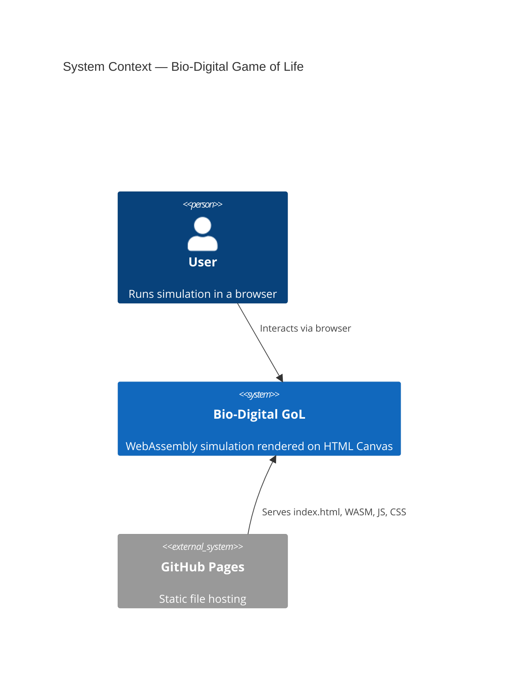
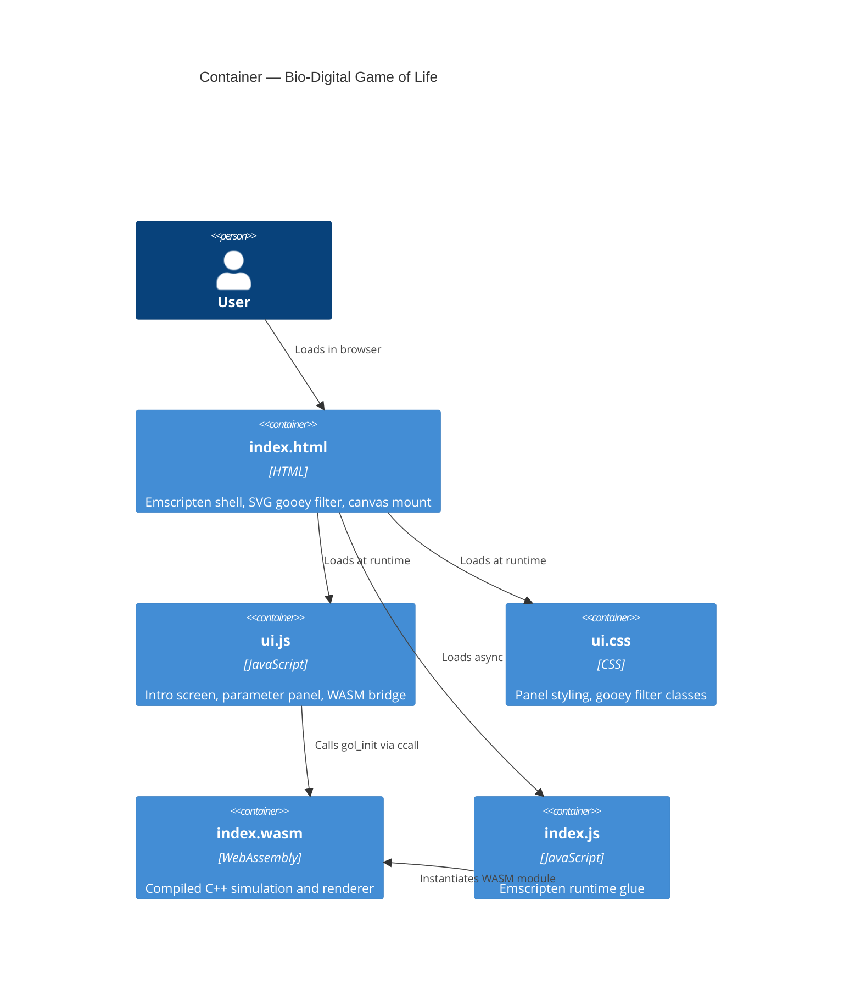
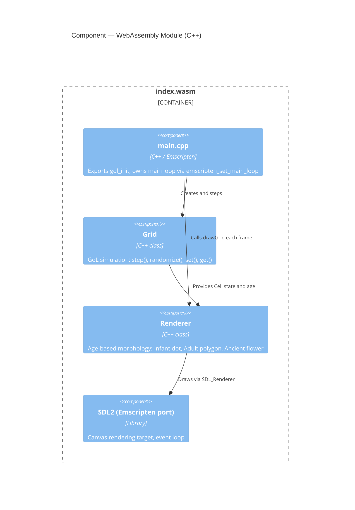
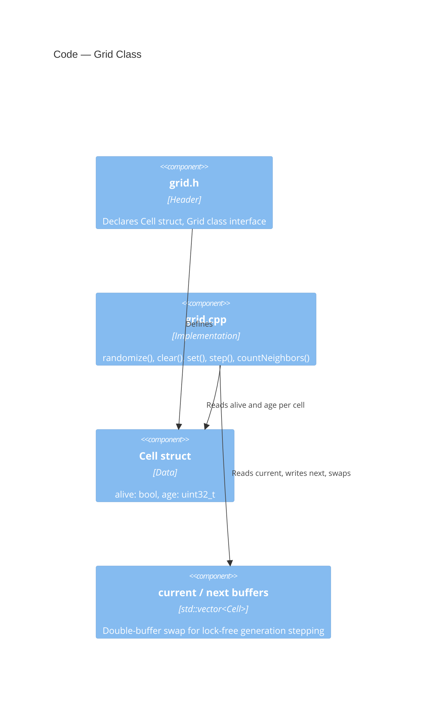

# Game of Life SVG

A PNG-independent, procedurally rendered Conway's Game of Life compiled to WebAssembly via Emscripten. Cells are drawn as living organisms that morph based on their age — no external assets, no image files.

> **This project was an exercise in learning C++ → WebAssembly → GitHub Pages deployment**, exploring how far a cellular automaton can be pushed visually using only code-generated graphics.

---

## What is Conway's Game of Life?

Invented by mathematician John Conway in 1970, the Game of Life is a zero-player simulation. From four simple rules about birth, survival, and death, complex emergent behavior arises — gliders that travel across the grid, oscillators that pulse forever, and chaotic patterns that stabilize after hundreds of generations.

---

## What makes this version different?

Instead of drawing cells as plain squares, each cell is rendered based on its **age** (how many generations it has survived):

| Stage | Age | Shape | Color |
|-------|-----|-------|-------|
| Infant | 1–5 gen | Pulsing dot | 🟢 Green |
| Adult | 6–20 gen | Polygon (sides = neighbor count) | 🔵 Cyan |
| Ancient | 21+ gen | Polar flower `r = cos(kθ)` | 🟡 Gold |

A CSS **gooey filter** (blur + contrast) makes adjacent cells fuse into organic membranes.

---

## Architecture

### Level 1 — System Context



---

### Level 2 — Container



---

### Level 3 — Component



---

### Level 4 — Code



---

## File Structure

```
gol/
├── src/
│   ├── main.cpp        # Emscripten entry, main loop, gol_init export
│   ├── grid.cpp        # GoL simulation logic
│   └── renderer.cpp    # Age-based morphology drawing
├── include/
│   ├── grid.h
│   └── renderer.h
├── shell.html          # Emscripten HTML shell, SVG gooey filter
├── ui.js               # Intro screen, parameter panel, WASM bridge
├── ui.css              # Styling
├── Makefile
└── index.html          # Build output (gitignored)
```

---

## Building locally

Requires [Emscripten](https://emscripten.org/docs/getting_started/downloads.html).

```bash
# Activate Emscripten environment (Windows)
cd emsdk && .\emsdk_env.bat && cd ..\gol

# Compile
em++ -std=c++17 -O2 -Iinclude \
  src/main.cpp src/grid.cpp src/renderer.cpp \
  -s WASM=1 -s USE_SDL=2 -s ALLOW_MEMORY_GROWTH=1 \
  -s EXPORTED_FUNCTIONS='["_gol_init"]' \
  -s EXPORTED_RUNTIME_METHODS='["ccall","cwrap"]' \
  --shell-file shell.html -o index.html

# Serve
emrun index.html
```

---

## Deployment

Pushes to `main` automatically build and deploy via GitHub Actions to GitHub Pages.

---

## License

MIT